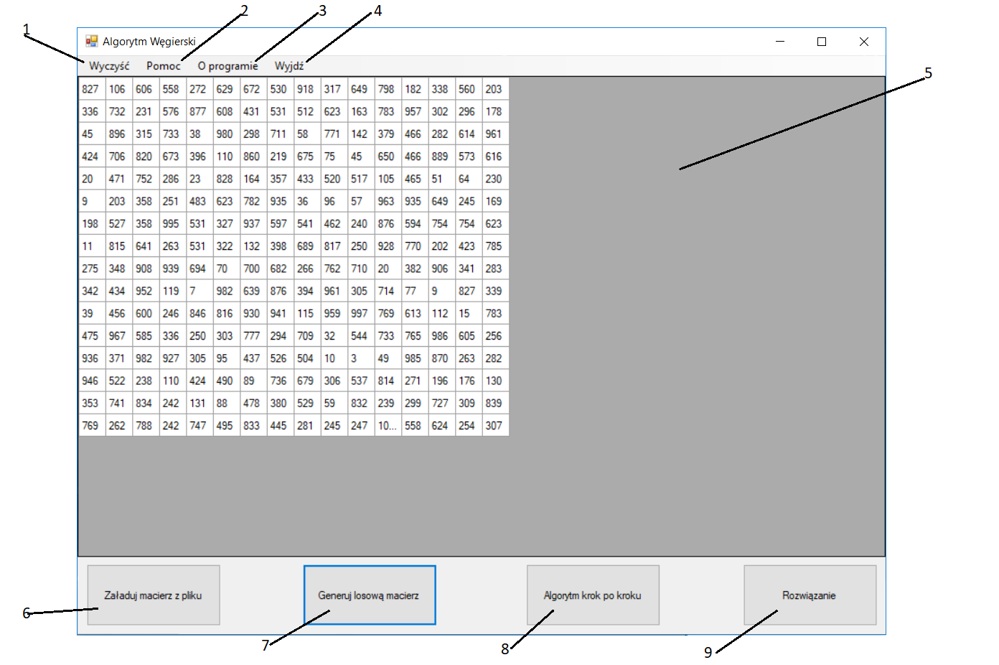

# Hungarian-Algorithm

## Informacje

Program wykorzystuje metodę węgierską. Została ona dopracowana oraz opublikowana przez Harolda Kuhna w roku 1955.
Została ona nazwana „*metodą węgierską*” z uwagi na fakt, że została ona wyprowadzona na podstawie wcześniejszych prac
dwóch węgierskich matematyków: Dénesa Kőniga i Jenő Egerváry'ego. Algorytm jest wykorzystywany przy problemie
przydziału. Na przykład jak należy przydzielid pracowników do maszyn, jeśli każdy pracownik ma określony koszt pracy przy
danej maszynie oraz może pracowad tylko przy jednej maszynie, aby koszt przydzielenie wszystkich pracowników był jak
najmniejszy.

Aplikacja jest napisana w języku C# oraz wykorzystuje Windows Forms.

**Opis problemu**: Mamy do dyspozycji n pracowników i tyle samo maszyn. Koszt pracy każdego pracownika przy każdej
maszynie jest znany. Wartości przedstawiamy za pomocą macierzy. Każda maszyna może byd obsługiwana, przez co
najwyżej jednego pracownika. Naszym zadaniem jest takie przypisanie pracowników do maszyn, aby każdy pracował oraz
żeby koszt pracy wszystkich pracowników był jak najmniejszy.

## Opis algorytmu
* **Krok 1**: W każdym wierszu macierzy znajdujemy najmniejszą liczbę i odejmujemy ją od każdego elementu w
danym wierszu.
* **Krok 2**: W każdej kolumnie macierzy znajdujemy najmniejszą liczbę i odejmujemy ją od każdego elementu w danej
kolumnie.
* **Krok 3**: Zakreślamy wszystkie 'zera' występujące w macierzy jak najmniejszą liczbą linii.
  * Jeśli liczba linii jest równa n to przechodzimy do **kroku 4**.
  * W przeciwnym wypadku znajdujemy minimum wśród liczb niezakreślonych, odejmuje je od wszystkich
niezakreślonych elementów i dodajemy do wszystkich elementów leżących na przecięciu dwóch linii
zakreślonych. Potem wracamy do **kroku 3**.
* **Krok 4**: Startując od pierwszego wiersza i idąc w dół dokonujemy przypisao 'pracownik-maszyna'. Przypisanie
może byd jednoznaczne tylko wtedy, jeżeli w danym wierszu występuje dokładnie jedno zero. Jeżeli po przejściu
wszystkich wierszy nie byliśmy w stanie dokonad wszystkich n przypisao to przechodzimy na kolumny. Startujemy
z kolumny pierwszej i idziemy w prawo. Może wystąpid taka sytuacja, że będziemy mieli więcej zer w danym
wierszu. Wtedy należy arbitralnie wybrad przypisanie.

## Instrukcja obsługi
Po uruchomieniu programu pojawia się prosta aplikacja okienkowa.

1. „*Wyczyść*” – Czyści macierz.
2. „*Pomoc*” – Otwiera plik z instrukcją obsługi.
3. „*O programie*” – Otwiera plik z ogólnymi informacjami o aplikacji i twórcach.
4. „*Wyjdź*” – Zamyka aplikację.
5. Miejsce na wyświetlenie macierzy.
6. „*Załaduj macierz z pliku*” – Otwiera okienko, które pozwala na wczytanie własnej macierzy kwadratowej z pliku
tekstowego.
7. „*Generuj losową macierz*” – Tworzy losową macierz kwadratową o maksymalnych wymiarach 40x40 i wartościach
z przedziału (0,1001).
8. Po prawej od przycisku nr. 7 po wczytaniu się macierzy pojawi się przycisk „*Algorytm krok po kroku*” pozwalający
na przeprowadzenie algorytmy krok po kroku. Każdy kolejny krok zostanie wykonany po naciśnięciu tego
przycisku. W kroku 1 oraz w kroku 2 zera zostają wyróżnione kolorem czerwonym, a w kroku 3 zakreślone linie
zostają przedstawione za pomocą niebieskich linii. Pod koniec rozwiązanie (poszukiwane wartości) zmieniają kolor
na zielony.
9. W prawym dolnym rogu okienka (po prawej stronie przycisku nr. 8) po wczytaniu się macierzy pojawi się przycisk
„*Rozwiązanie*”, który umożliwia natychmiastowe wyświetlenie przypisania 'pracownik-maszyna'. Wyświetla
macierz początkową z zaznaczonymi szukanymi (rozwiązaniami) wartościami na zielono.

Uwagi:
1. Jeśli chcemy wczytać własną macierz z pliku to musi byd ona kwadratowa. Każda spacja we wierszu oznacza
kolejną kolumnę w macierzy, należy pamiętad, żeby na koocu wiersza nie stawiad spacji, ponieważ to uniemożliwi
załadowanie macierzy.
2. Wartości powyżej 999, powodują gorsze wyświetlanie wartości w komórkach macierzy.
